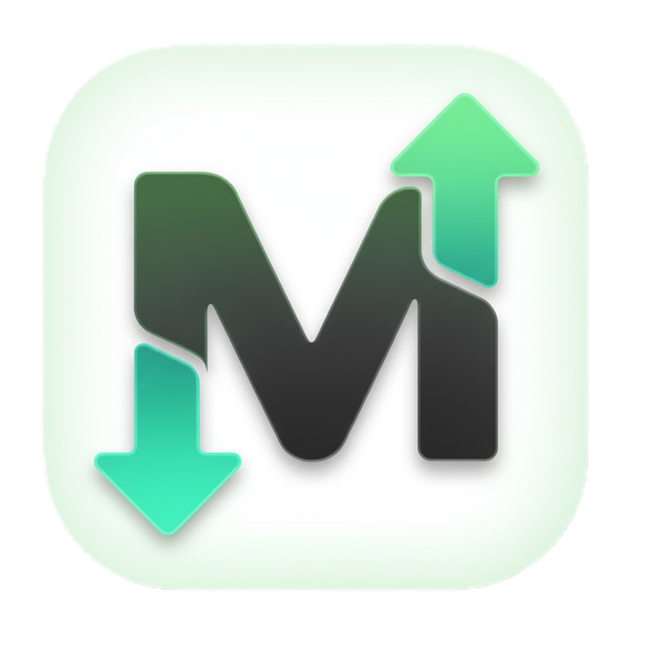

# UpDown - Markdown Viewer

A beautiful, native macOS application for viewing and exporting Markdown files. Built with [Wails](https://wails.io) and powered by [goldmark](https://github.com/yuin/goldmark).

## Features

- 📝 **Rich Markdown Rendering** - View Markdown files with full formatting support
- 🎨 **Mermaid Diagrams** - Render Mermaid flowcharts and diagrams
- 🖼️ **Image Support** - Display images with automatic path resolution
- 📄 **PDF Export** - Export your Markdown documents as PDF files
- 🖱️ **Drag & Drop** - Simply drag and drop Markdown files to open them
- 🔄 **Auto-refresh** - Automatically reloads when files change
- ⌨️ **Keyboard Shortcuts** - Full keyboard support for common operations




## Installation

### Prerequisites

- Go 1.25 or later
- [Wails v2](https://wails.io/docs/gettingstarted/installation)
- macOS (for building the macOS app)

### Build from Source

1. Clone the repository:
```bash
git clone https://github.com/neshkoli/updown.git
cd updown
```

2. Install dependencies:
```bash
go mod download
```

3. Build the application:
```bash
./build.sh
```

Or use Wails directly:
```bash
wails build
```

The built application will be in `build/bin/updown.app`.

### Running in Development Mode

To run with live reloading and debugging:
```bash
wails dev
```

## Usage

### Opening Files

- **Menu**: File > Open... (⌘O)
- **Drag & Drop**: Drag a Markdown file into the window
- **Command Line**: `./updown.app/Contents/MacOS/updown path/to/file.md`

### Exporting to PDF

- **Menu**: File > Export as PDF... (⌘E)
- Select the destination and save

### Keyboard Shortcuts

- `⌘O` - Open file
- `⌘E` - Export as PDF
- `⌘Q` - Quit application

## Supported Markdown Features

- Headers (H1-H6)
- **Bold** and *italic* text
- ~~Strikethrough~~
- `Inline code` and code blocks
- Lists (ordered and unordered)
- Tables
- Blockquotes
- Links
- Images (with relative path support)
- Mermaid diagrams
- Horizontal rules

## Project Structure

```
updown/
├── app.go              # Main application logic
├── main.go             # Application entry point
├── frontend/
│   └── dist/
│       └── index.html # Frontend UI
├── build.sh           # Build script
├── run.sh             # Run script
├── wails.json         # Wails configuration
└── README.md          # This file
```

## Credits

This project uses the following excellent libraries:

- **[goldmark](https://github.com/yuin/goldmark)** by [@yuin](https://github.com/yuin) - The powerful Markdown parser that does most of the heavy lifting for rendering Markdown content
- **[Wails v2](https://wails.io)** - The framework for building native desktop applications
- **[goldmark-mermaid](https://github.com/abhinav/goldmark-mermaid)** - Mermaid diagram support for goldmark
- **[Mermaid.js](https://mermaid.js.org/)** - Diagram and flowchart rendering
- **[html2pdf.js](https://github.com/eKoopmans/html2pdf.js)** - PDF generation from HTML

## License

This project is open source. Please check the individual licenses of the dependencies listed above.

## Contributing

Contributions are welcome! Please feel free to submit a Pull Request.

## Author

[Noam Eshkoli](https://github.com/neshkoli)
