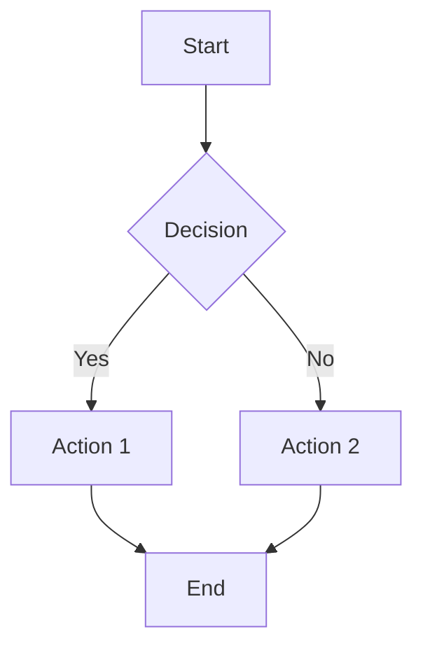

# UpDown - Markdown Viewer

A full-featured native Markdown viewer built with Go and Wails. Supports standard Markdown conventions, Mermaid diagrams, and images. **All content is displayed directly inside the application window** - no external browser required. Cross-platform support for macOS, Windows, and Linux.

## Features

- ✅ **Standard Markdown Support**: Full support for CommonMark and GitHub Flavored Markdown (GFM)
- ✅ **Mermaid Diagrams**: Render Mermaid diagrams directly in your Markdown files
- ✅ **Image Support**: Display images referenced in Markdown files
- ✅ **Native Desktop App**: Built with Go and Wails for a native cross-platform experience
- ✅ **Embedded Display**: All content rendered inside the app window - no external browser needed
- ✅ **Drag and Drop**: Simply drag a Markdown file into the window to open it
- ✅ **Live Reload**: Automatically reloads content when the source file changes

## Requirements

- macOS, Windows, or Linux
- Go 1.19 or later (for building from source)
- Wails v2 (install with `go install github.com/wailsapp/wails/v2/cmd/wails@latest`)

## Installation

### Build from Source

1. Clone or download this repository
2. Install Wails CLI (if not already installed):
   ```bash
   go install github.com/wailsapp/wails/v2/cmd/wails@latest
   ```
3. Build the application:
   ```bash
   ./build.sh
   ```
   This script will:
   - Convert `UpDown.png` to the required `.icns` format
   - Build the application with Wails
   - Install the custom icon in the app bundle
   
   Alternatively, you can build manually:
   ```bash
   ./convert_icon.sh  # Convert PNG to .icns
   wails build        # Build the app
   ./fix_icon.sh      # Install the icon
   ```
   
   This will create the app in `build/bin/updown.app` (macOS) or `build/bin/updown` (Linux/Windows)

4. Run the application:
   - **macOS**: Open `build/bin/updown.app` or run `open build/bin/updown.app`
   - **Linux/Windows**: Run `./build/bin/updown`

### Development Mode

For development with hot-reload:
```bash
wails dev
```

## Usage

### Opening a File

1. **From Command Line**: Pass the markdown file path as an argument:
   ```bash
   ./updown path/to/your/file.md
   ```

2. **Drag and Drop**: 
   - Launch the application
   - Drag a Markdown file from Finder (or your file manager) and drop it into the application window
   - The file will automatically open and display

3. **From the Menu**: 
   - Launch the application
   - Click **File > Open...** in the menu bar
   - Select your Markdown file using the native file dialog

### Viewing Content

When you open a Markdown file:
- The application starts an embedded web server
- The content is displayed **directly in the application window**
- The content includes full HTML rendering with:
  - Styled text and headings
  - Code blocks with syntax highlighting
  - Tables
  - Lists and blockquotes
  - **Mermaid diagrams** (rendered client-side with JavaScript)
  - **Images** (served from the markdown file's directory)

### Reloading

Click the "Reload" button in the toolbar to refresh the content if you've made changes to the Markdown file.

## Markdown Features

### Standard Markdown

The viewer supports all standard Markdown syntax:
- Headings (`#`, `##`, etc.)
- **Bold** and *italic* text
- Lists (ordered and unordered)
- Links and images
- Code blocks and inline code
- Blockquotes
- Tables
- Horizontal rules

### Mermaid Diagrams

Include Mermaid diagrams in your Markdown using code blocks:

````markdown

````

The viewer will automatically render these diagrams using Mermaid.js **directly in the app window**.

### Images

Reference images in your Markdown files:

```markdown

```

The viewer will:
- Serve images from the same directory as your Markdown file
- Support relative paths
- Handle images in subdirectories

**Note**: Images are served through the embedded web server, so they must be accessible from the Markdown file's directory.

## Architecture

- **UI Framework**: [Lorca](https://github.com/zserge/lorca) - Lightweight webview library for Go
- **Markdown Parser**: [Goldmark](https://github.com/yuin/goldmark) - Extensible Markdown parser
- **Mermaid Support**: [goldmark-mermaid](https://github.com/abhinav/goldmark-mermaid) - Mermaid extension for Goldmark
- **Rendering**: HTML rendering with embedded web server and webview for full JavaScript support

## How It Works

1. The application uses **Lorca** to create a native window with an embedded webview
2. When you open a Markdown file:
   - Goldmark parses the Markdown content
   - The content is converted to HTML
   - Image paths are processed to work with the web server
   - An embedded HTTP server starts on a random port
   - The webview navigates to the server URL
   - **Content is displayed directly in the app window** (not in an external browser)
   - Mermaid.js is loaded client-side to render diagrams

## Key Differences from Previous Version

- ✅ **No External Browser**: All content is displayed inside the application window
- ✅ **Native Go Solution**: Uses lorca webview instead of Fyne
- ✅ **Simpler Architecture**: Direct webview integration for HTML/JS rendering
- ✅ **Better Integration**: Content feels more integrated with the app

## Limitations

- Requires Chrome/Chromium to be installed (lorca uses it for the webview)
- The embedded web server runs only while the application is running
- Images must be accessible from the Markdown file's directory
- File selection uses native dialogs (osascript on macOS)

## Development

### Dependencies

The project uses the following main dependencies:
- `github.com/zserge/lorca` - Webview library
- `github.com/yuin/goldmark` - Markdown parser
- `go.abhg.dev/goldmark/mermaid` - Mermaid extension

Install dependencies:
```bash
go mod download
```

### Building

```bash
go build -o updown
```

## License

This project is provided as-is for use and modification.

## Contributing

Feel free to submit issues or pull requests to improve the viewer!
