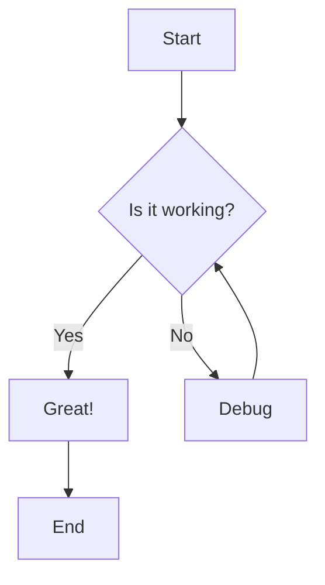
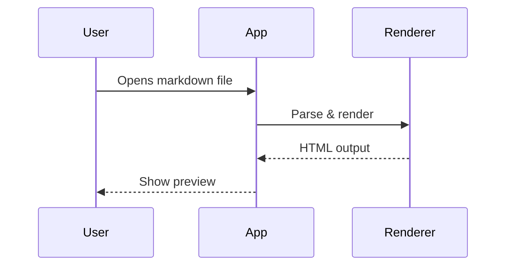
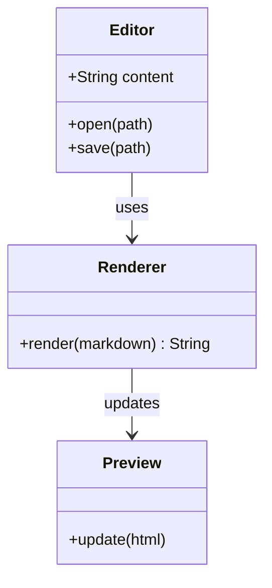
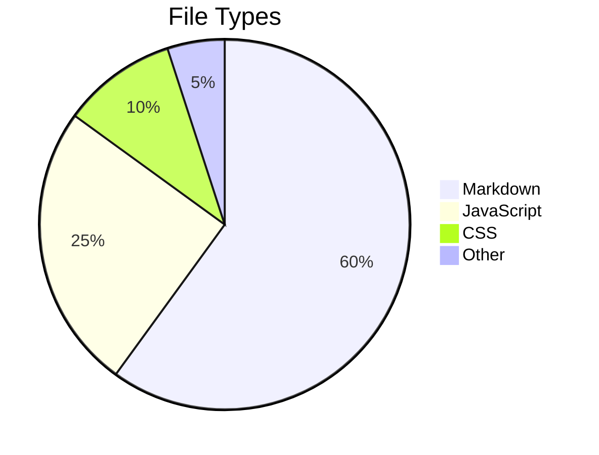
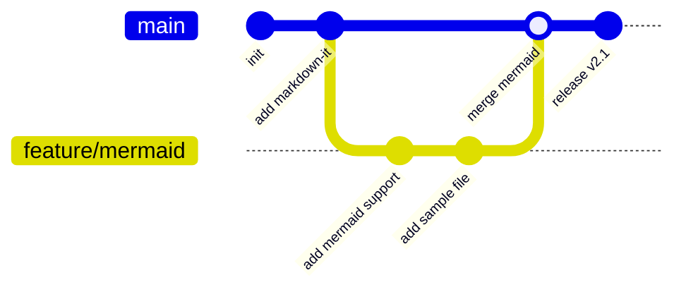
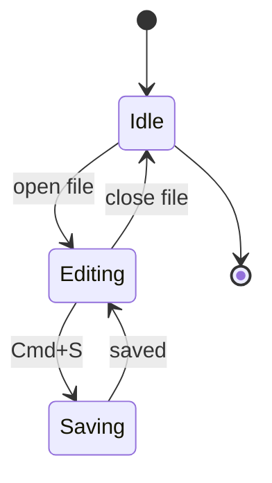

# Mermaid Diagrams Sample

This file demonstrates Mermaid diagram support in UpDown.

---

## Flowchart

---

## Sequence Diagram

---

## Class Diagram

---

## Pie Chart

---

## Git Graph

---

## State Diagram

