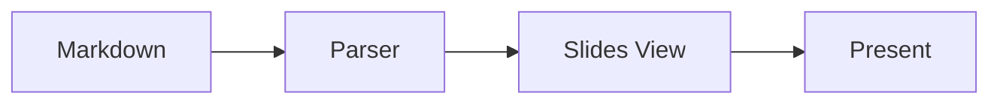

# Welcome to JFrog

A presentation built with UpDown

---

## Features

- Slidev-compatible `---` separators
- Theme from metadata (`theme: jfrog`)
- Keyboard navigation (← → Space F)
- Fullscreen present mode

---

## Code example

```javascript
const deck = parseSlides(markdown);
console.log(deck.slides.length);
```

---

## Diagram


