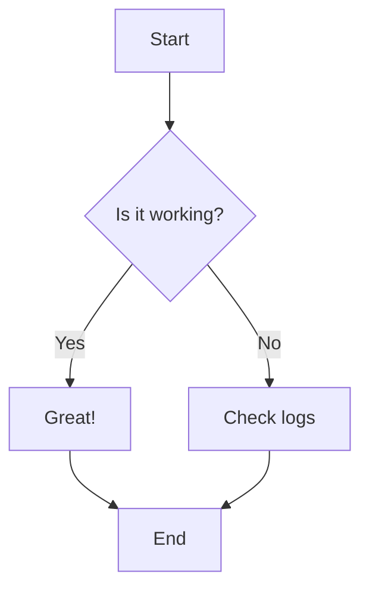

# Sample Markdown Document

This is a sample Markdown file to test the **Updown** Markdown viewer.

## Features Demonstration

### Text Formatting

- **Bold text**
- *Italic text*
- ~~Strikethrough~~
- `Inline code`

### Lists

1. First item
2. Second item
3. Third item

- Unordered item 1
- Unordered item 2
  - Nested item

### Code Block

```go
package main

import "fmt"

func main() {
    fmt.Println("Hello, World!")
}
```

### Mermaid Diagram



### Table

| Feature | Status |
|---------|--------|
| Markdown | ✅ |
| Mermaid | ✅ |
| Images | ✅ |

### Blockquote

> This is a blockquote.
> It can span multiple lines.

### Horizontal Rule

---

## Images

To test images, add an image file in the same directory and reference it:

```markdown

```

